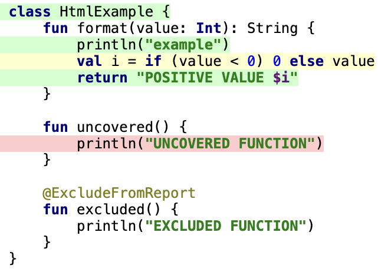

# Kover Gradle Plugin

Gradle plugin that measures the coverage for tests running on the JVM and generates coverage reports.

## Table of contents
  * [Features](#features)
  * [Quickstart](#quickstart)
  * [Project types](#build-types)
    * [Single module Kotlin JVM project](#single-module-kotlin-jvm-project)
    * [Single module Kotlin multiplatform project](#single-module-kotlin-multiplatform-project)
    * [Multi-module Kotlin JVM project](#multi-module-kotlin-jvm-project)
    * [Multi-module Kotlin multiplatform project](#multi-module-kotlin-multiplatform-project)
    * [Kotlin single-module Android project](#kotlin-single-module-android-project)
    * [Kotlin multi-module Android project](#kotlin-multi-module-android-project)
    * [Kotlin multiplatform mixed Android and JVM project](#kotlin-multiplatform-mixed-android-and-jvm-project)
  * [Configuration details](#configuration-details)
    * [Apply Kover Gradle Plugin in project](#apply-kover-gradle-plugin-in-project)
    * [Specify verification rules for total variant](#specify-verification-rules-for-total-variant)
    * [Specify verification rules for named variant](#specify-verification-rules-for-named-variant)
    * [Configuring report tasks](#configuring-report-tasks)
    * [Verification](#verification)
    * [Instrumentation](#instrumentation)
    * [Class name with wildcards](#class-name-with-wildcards)
    * [Filtering reports](#filtering-reports)
    * [Exclusion of JVM source sets](#exclusion-of-jvm-source-sets)
  * [Extra info](#extra-info)
    * [Invoke Kover tasks](#invoke-kover-tasks)
    * [HTML report description](#html-report-description)
    * [Using JaCoCo](#using-jacoco)
    * [Implicit plugin dependencies](#implicit-plugin-dependencies)
    * [DSL reference](dokka)

## Features

* Collection of code coverage through `JVM` tests (JS and native targets are not supported yet).
* Generating `HTML` and `XML` reports.
* Verification rules with bounds to keep track of coverage.
* Create tasks to generate reports and automatically adjust the dependencies between it
* Detect project source code, compilation tasks, test tasks, Android build variant for automatic Kover task configuration
* Support for `Kotlin JVM`, `Kotlin Multiplatform` projects.
* Support for `Kotlin Android` projects with build variants (instrumentation tests executing on the Android device are not supported yet).
* Support mixed `Kotlin` and `Java` sources
* Using JaCoCo library as an alternative for coverage measuring and report generation.

## Quickstart
To write a minimal configuration of the plugin, find the type of your Gradle build below with all the instructions.

## Build types
### Single module Kotlin JVM project

A single module project doesn't require any additional setup except the application of the plugin itself, and optional configuration of rules and reports.

#### Application of Kover plugin
Add the following to your build file:

```kotlin
plugins {
     id("org.jetbrains.kotlinx.kover") version "0.8.0"
}
```
For more information about application of the plugin, refer to the [relevant section](#apply-kover-gradle-plugin-in-project)

After applying Kover Gradle plugin, the classes are modified (instrumented) when loaded into the JVM during regular test runs, 
so the number of line hits can be counted. This may impact your testing experience. 
To learn more about instrumentation, its configuring, and solutions for typical problems, please refer to the [corresponding section](#instrumentation).

#### Generating reports
- To generate a JaCoCo-compatible XML report, call `koverXmlReport` Gradle task
- To generate an HTML report, call `koverHtmlReport` Gradle task
- To validate verification rules specified in the project in [verification block](#specify-verification-rules-for-total-variant), call `koverVerify` Gradle task
- To generate [a binary report](#binary-reports) in IC format, call `koverBinaryReport` Gradle task
- To print coverage to the log, call `koverLog` Gradle task

Running one of these tasks automatically triggers the launch of all test tasks in the project.

To exclude the automatic launch of a certain task and never take into account the coverage of this task, follow [this section](#exclusion-of-test-tasks). Exclusion of specific classes or annotations can be configured through [report filtering](#filtering-reports).

#### Example
The full example for a single module project can be found [here](https://github.com/Kotlin/kotlinx-kover/tree/main/kover-gradle-plugin/examples/jvm/single).

#### Adding verification rules
```kotlin
kover {
    reports {
        verify {
            // add new verification rule
            rule {
                // specify coverage bounds for the rule
            } 
        }
    }
}
```
You can read more about creating verification rules in the [corresponding section](#verification).

#### Configuring Reports
The configuration of the report generation tasks takes place in a block for aggregated tasks

```kotlin
kover {
    reports {
        total {
            // configuring report tasks
        }
    }
}
```

Available configuration options are listed in a [separate section](#configuring-report-tasks).

----

### Single module Kotlin multiplatform project
Kover supports coverage measurement only for JVM targets. 
Source code outside the common and JVM source sets is ignored. 
Therefore, coverage for non-JVM tests is not collected.

Otherwise, the use of the plugin is identical to the use in the [single module Kotlin JVM project](#single-module-kotlin-jvm-project).

Please refer to the [example project](https://github.com/Kotlin/kotlinx-kover/tree/main/kover-gradle-plugin/examples/jvm/single-kmp).

----

### Multi-module Kotlin JVM project
#### Application of Kover plugin
Add the following line to build file in each module of your Gradle build:

```kotlin
plugins {
     id("org.jetbrains.kotlinx.kover") version "0.8.0"
}
```
It is recommended to apply the Kover Plugin in the root module, even if there is no source code or tests there.
You [do not need to specify](#application-in-submodule-with-plugins-dsl) the plugin version in all submodules.

For more information about application of the plugin, refer to the [relevant section](#apply-kover-gradle-plugin-in-project)

After applying Kover Gradle plugin, the classes are modified (instrumented) when loaded into the JVM during regular test runs,
so number of line hits can be counted. This may impact your testing experience.
To learn more about instrumentation, its configuring, and solutions for typical problems, please refer to the [corresponding section](#instrumentation).

#### Merging reports from different modules
In multi-module projects, it is often the case that code in some module (let's name it A) is being tested by tests in some other module B.
In such a setup, when you run `:A:koverReport` alone, you would get 0% coverage since module A does not contain any tests.
For classes and coverage from all necessary modules to be included in the report, you have to configure report merging.

For this:
1. select the module that will collect information about all classes and from which the report generation will be launched.
  let's call such a module **merging module**. We recommend using the root module (root Gradle project) as a **merging module**.
  Note: running `koverHtmlReport` in merging module will automatically run tests in all dependent modules.
2. add dependencies in the **merging module** to all other modules whose classes and coverage counters should be included in the merged report
```kotlin
dependencies {
    kover(project(":moduleA"))
    kover(project(":moduleB"))
}
```

#### Generating reports
Suppose if we chose the root module as the merging module, then

- To generate a JaCoCo-compatible XML report, call `:koverXmlReport` Gradle task
- To generate an HTML report, call `:koverHtmlReport` Gradle task
- To validate verification rule specified in project in [verification block](#specify-verification-rules-for-total-variant), call `:koverVerify` Gradle task
- To generate [a binary report](#binary-reports) in IC format, call `:koverBinaryReport` Gradle task
- To print coverage to the log, call `:koverLog` Gradle task

If a module with the path `:foo` was selected as the merging module, then you will need to call commands like `:foo:koverXmlReport`, etc.

Running one of these tasks automatically triggers the launch of all test tasks from merging module and the modules specified in it as `kover` dependencies.

It is recommended to use only full path commands since short names like `koverXmlReport` will run all tests in all projects, even if they are not specified as `kover` dependencies.

To exclude the automatic launch of a certain task and never take into account the coverage of this task, you should additionally [configure the corresponding project](#exclusion-of-test-tasks). Exclusion of specific classes or annotations can be configured through [report filtering](#filtering-reports).

#### Example
The full example for a multi-module Kotlin JVM project can be found [here](https://github.com/Kotlin/kotlinx-kover/tree/main/kover-gradle-plugin/examples/jvm/merged).

#### Adding verification rules

To add verification rules, in the build script file of the merging module (and only in it) it is necessary to specify the following:
```kotlin
kover {
    reports {
        verify {
            // add new verification rule
            rule {
                // specify coverage bounds for the rule
            } 
        }
    }
}
```
You can read more about creating verification rules in the [corresponding section](#verification).

#### Configuring Reports
The configuration of the report generation tasks takes place in a block for aggregated tasks in the build script file of the merging module (and only in it). 

```kotlin
kover {
    reports {
        total {
            // configuring report tasks
        }
    }
}
```

Available configuration options are listed in a [separate section](#configuring-report-tasks).

----

### Multi-module Kotlin multiplatform project

Kover supports coverage measurement only for JVM targets.
Source code outside the common and JVM source sets is ignored. 
Therefore, coverage for non-JVM tests is not collected.

Otherwise, the use of the plugin is identical to the use in the [multi-module Kotlin JVM project](#multi-module-kotlin-jvm-project).

----

### Kotlin single-module Android project
#### Application of Kover plugin
Add the following to the build file only in the `app` module of your Gradle build:
```kotlin
plugins {
     id("org.jetbrains.kotlinx.kover") version "0.8.0"
}
```

For more information about application of the plugin, refer to the [relevant section](#apply-kover-gradle-plugin-in-project)

After applying Kover Gradle plugin, the classes are modified (instrumented) when loaded into the JVM during local unit test runs,
so number of line hits can be counted. This may impact your testing experience.
At the moment, the instrumented (on-device) tests are not being modified by Kover and coverage for them can not be collected.

To learn more about instrumentation, its configuring, and solutions for typical problems, please refer to the [corresponding section](#instrumentation).

#### Using Android Build Variants
In the Android Gradle Plugin, the module is divided into different **build variants** (flavor + build type), which may have different source sets and tests.
For each Gradle Build Variant, Kover creates its own **report variant** that have the same names.

The **report variant** includes only the classes declared in the corresponding **build variant**, and also runs only tests for this **build variant**.
Kover also creates a special **report variant**, which includes all classes and all tests of the module. This variant is called the **total variant** - and it does not have a special name.
The names of the **report variants** are used when configuring the report and when running report generation tasks.


If there is a need to generate a report from classes of several **build variants**, then you can create custom **report variant**:
```kotlin
kover {
    currentProject {
        createVariant("custom") {
            add("libDebug")
            add("appDebug")
        }  
    }
}
```
Thus, a **report variant** `custom` will be created, which contains classes and tests from the `libDebug` and `appDebug` **build variants**.

#### Total report variant
Kover also creates a special **report variant**, which includes all classes and all tests of the module. This variant is called the **total variant** - and it does not have a special name.
The names of the **report variants** are used when configuring the report and when running report generation tasks.

#### Generating reports
Reports can be generated for a single build variant, or for all at once.

Let's say we want to generate a report for the `debug` build variant and the Android application module has the name `app`:
- To generate a JaCoCo-compatible XML report, call `:app:koverXmlReportDebug` Gradle task
- To generate an HTML report, call `:app:koverHtmlReportDebug` Gradle task
- To validate verification rules specified in the project in [verification block](#specify-verification-rules-for-named-variant), call `:app:koverVerifyDebug` Gradle task
- To generate [a binary report](#binary-reports) in IC format, call `:app:koverBinaryReportDebug` Gradle task
- To print coverage to the log, call `:app:koverLogDebug` Gradle task

The general rule is that the name of the build variant is always added at the end

Running one of these tasks automatically triggers the launch of all test tasks for `debug` build variant in `app` module.
To exclude the automatic launch of a certain task and never take into account the coverage of this task, you should additionally [configure the corresponding project](#exclusion-of-test-tasks). Exclusion of specific classes or annotations can be configured through [report filtering](#filtering-reports).


If you need a total report for the `app` module (all classes from all build variants), then:
- To generate a JaCoCo-compatible XML report, call `:app:koverXmlReport` Gradle task
- To generate an HTML report, call `:app:koverHtmlReport` Gradle task
- To validate verification rule specified in project in [verification block](#specify-verification-rules-for-total-variant), call `:app:koverVerify` Gradle task
- To generate [a binary report](#binary-reports) in IC format, call `:app:koverBinaryReport` Gradle task
- To print coverage to the log, call `:app:koverLog` Gradle task

Running one of these tasks automatically triggers the launch of all test tasks in `app` module.
To exclude the automatic launch of a certain task and never take into account the coverage of this task, you should additionally [configure the corresponding project](#exclusion-of-test-tasks). Exclusion of specific classes or annotations can be configured through [report filtering](#filtering-reports).

#### Example
The full example for a single-module Android project can be found [here](https://github.com/Kotlin/kotlinx-kover/tree/main/kover-gradle-plugin/examples/android/minimal_kts).

#### Adding verification rules

To add verification rules which will be checked in every build/report variant and for the entire `app` module, it is necessary to specify the following:
```kotlin
kover {
    reports {
        verify {
            // add new verification rule
            rule {
                // specify coverage bounds for the rule
            } 
        }
    }
}
```

If it is necessary to add a verification rule that will be checked only for a specific build variant, you need to configure this variant individually:
```kotlin
kover {
    reports {
        variant("debug") {
            verify {
                // add new verification rule
                rule {
                    // specify coverage bounds for the rule
                }
            }
        }
    }
}
```
in this example, a verification rule is added for the `debug` build variant report

You can also add a verification rule for a total variant, but leave specific build/report variants without it:
```kotlin
kover {
    reports {
        total {
            verify {
                // add new verification rule
                rule {
                    // specify coverage bounds for the rule
                }
            }
        }
    }
}
```

You can read more about creating verification rules in the [corresponding section](#verification).


#### Configuring Reports
The configuration of the report generation for `debug` build variant: 

```kotlin
kover {
    reports {
        variant("debug") {
            // configuring report tasks for debug build variant
        }
    }
}
```

The configuration of the report generation for all classes:
```kotlin
kover {
    reports {
        total {
            // configuring report tasks
        }
    }
}
```

Available configuration options are listed in a [separate section](#configuring-report-tasks).

----

### Kotlin multi-module Android project
#### Application of Kover plugin
Add the following to build file in each module of your Gradle build:

```kotlin
plugins {
     id("org.jetbrains.kotlinx.kover") version "0.8.0"
}
```
It is recommended to apply the Kover Plugin in the root module, even if there is no source code or tests there.
You [do not need to specify](#application-in-submodule-with-plugins-dsl) the plugin version in all submodules.

For more information about application of the plugin, refer to the [relevant section](#apply-kover-gradle-plugin-in-project)

After applying Kover Gradle plugin, the classes are modified (instrumented) when loaded into the JVM during local unit test runs,
so number of line hits can be counted. This may impact your testing experience.
At the moment, the instrumented (on-device) tests are not being modified by Kover and coverage for them can not be collected.

To learn more about instrumentation, its configuring, and solutions for typical problems, please refer to the [corresponding section](#instrumentation).


#### Using Android Build Variants
In the Android Gradle Plugin, the module is divided into different **build variants** (flavor + build type), which may have different source sets and tests.
For each Gradle Build Variant, Kover creates its own **report variant** that have the same names.

The **report variant** includes only the classes declared in the corresponding **build variant**, and also runs only tests this **build variant**.

If there is a need to generate report from classes of several **build variants**, then you could create custom **report variant** in each module:
```kotlin
kover {
    currentProject {
        createVariant("custom") {
            add("libDebug")
            add("appDebug")
        }  
    }
}
```
Thus, a **report variant** `custom` will be created, which contains classes and tests from the `libDebug` and `appDebug` **build variants**.

#### Total report variant
Kover also creates a special **report variant**, which includes all classes and all tests of the module. This variant is called the **total variant** - and it does not have a special name.
The names of the **report variants** are used when configuring the report and when running report generation tasks.

#### Different Build Variants in different modules
Suppose you have two modules, `:app1`, `:app2` and build variants differ between these unrelated modules.
Let it be `debug` and `release` in the `:app1`, and `mainDebug`, `extraDebug` and `release` in the `:app2`.

If you need to create a report containing classes from some set of build variants out of these two modules at the same time, 
 then you should create a custom report variant in each module.

For example, you need classes from `debug` build variant from `:app1`, and `extraDebug` from `:app2`.
Then you need to add these variants to the custom one in the appropriate modules:

In `:app1`
```kotlin
kover {
    currentProject {
        createVariant("custom") {
            add("debug")
        }  
    }
}
```
And in `:app2`
```kotlin
kover {
    currentProject {
        createVariant("custom") {
            add("extraDebug")
        }  
    }
}
```

After that, you should use the report generation tasks only for this custom variant, e.g. `koverHtmlReportCustom`.

#### Merging reports from different modules
In multi-module projects, it is often the case that code in some module (let's name it A) is being tested by tests in some other module B.
In such a setup, when you run `:A:koverReport` alone, you would get 0% coverage since module A does not contain any tests.
For classes and coverage from all necessary modules to be included in the report, you have to configure report merging.

For this:
1. select the module that will collect information about all classes and from which the report generation will be launched.
   let's call such a module **merging module**. We recommend using the root module (root Gradle project) as a **merging module**.
2. add dependencies in the **merging module** to all other modules whose classes should be included in the merged report
```kotlin
dependencies {
    kover(project(":moduleA"))
    kover(project(":moduleB"))
}
```

#### Generating reports
Reports can be generated for a single report variant, or for all classes.

Suppose if we chose the root module as the merging module.
Let's say we want to generate a report for the `debug` report:
- To generate a JaCoCo-compatible XML report, call `:koverXmlReportDebug` Gradle task
- To generate an HTML report, call `:koverHtmlReportDebug` Gradle task
- To validate verification rule specified in project in [verification block](#specify-verification-rules-for-named-variant), call `:koverVerifyDebug` Gradle task
- To generate [a binary report](#binary-reports) in IC format, call `:koverBinaryReportDebug` Gradle task
- To print coverage to the log, call `:koverLogDebug` Gradle task

The general rule is that the name of the report variant is always added at the end.

Running one of these tasks automatically triggers the launch of all test tasks for `debug` report variant in all merged module.
To exclude the automatic launch of a certain task and never take into account the coverage of this task, you should additionally [configure the corresponding project](#exclusion-of-test-tasks). Exclusion of specific classes or annotations can be configured through [report filtering](#filtering-reports).


If reports are needed for all classes in the merged modules, then:
- To generate a JaCoCo-compatible XML report, call `:koverXmlReport` Gradle task
- To generate an HTML report, call `:koverHtmlReport` Gradle task
- To validate verification rule specified in project in [verification block](#specify-verification-rules-for-total-variant), call `:koverVerify` Gradle task
- To generate [a binary report](#binary-reports) in IC format, call `:koverBinaryReport` Gradle task
- To print coverage to the log, call `:koverLog` Gradle task

Running one of these tasks automatically triggers the launch of all test tasks in all merged module.
To exclude the automatic launch of a certain task and never take into account the coverage of this task, you should additionally [configure the corresponding project](#exclusion-of-test-tasks). Exclusion of specific classes or annotations can be configured through [report filtering](#filtering-reports).

#### Example
The full example for multi-module Kotlin+Android project can be found [here](https://github.com/Kotlin/kotlinx-kover/tree/main/kover-gradle-plugin/examples/android/multiproject) and [here — with custom report variants](https://github.com/Kotlin/kotlinx-kover/tree/main/kover-gradle-plugin/examples/android/multiproject-custom).

#### Adding verification rules

To add verification rules which will be checked for each report variant and for all classes, it is necessary to specify the following in the build script file of the merging module (and only in it):
```kotlin
kover {
    reports {
        verify {
            // add new verification rule
            rule {
                // specify coverage bounds for the rule
            } 
        }
    }
}
```

If it is necessary to add a verification rule that will be checked only for a specific report variant, you need to create individual rules in the build script file of the merging module (and only in it):
```kotlin
kover {
    reports {
        variant("custom") {
            verify {
                // add new verification rule
                rule {
                    // specify coverage bounds for the rule
                }
            }
        }
    }
}
```
in this example, a verification rule is added for the `custom` report variant

If it is necessary that a verification rule be added for a report on all classes from merged modules, but does not affect reports on specific report variants, then:
```kotlin
kover {
    reports {
        total {
            verify {
                // add new verification rule
                rule {
                    // specify coverage bounds for the rule
                }
            }
        }
    }
}
```

You can read more about creating verification rules in the [corresponding section](#verification).


#### Configuring Reports
To configure of the report generation for `custom` report variant, it is necessary to specify the following in the build script file of the merging module (and only in it):

```kotlin
kover {
    reports {
        variant("custom") {
            // configuring report tasks for custom build variant
        }
    }
}
```

To configure of the report generation for all classes of merged modules, it is necessary to specify the following in the build script file of the merging module (and only in it):
```kotlin
kover {
    reports {
        total {
            // configuring report tasks
        }
    }
}
```

Available configuration options are listed in a [separate section](#configuring-report-tasks).

----

### Kotlin multiplatform mixed Android and JVM project
#### Application of Kover plugin
Add the following to build file in each module of your Gradle build:

```kotlin
plugins {
     id("org.jetbrains.kotlinx.kover") version "0.8.0"
}
```
It is recommended to apply the Kover Plugin in the root module, even if there is no source code or tests there.
You [do not need to specify](#application-in-submodule-with-plugins-dsl) the plugin version in all submodules.

For more information about application of the plugin, refer to the [relevant section](#apply-kover-gradle-plugin-in-project)

After applying Kover Gradle plugin, the classes are modified (instrumented) when loaded into the JVM during Android local unit test and JVM test runs,
so number of line hits can be counted. This may impact your testing experience.
At the moment, the instrumented (on-device) tests are not being modified by Kover and coverage for them can not be collected.

To learn more about instrumentation, its configuring, and solutions for typical problems, please refer to the [corresponding section](#instrumentation).

#### Create custom Report Variants
The module with Android Gradle Plugin or Kotlin multiplatform with Android target is divided into different **build variants** (flavor + build type), which may have different source sets and tests.
For each Gradle Build Variant, Kover creates its own **report variant** that have the same names.
Such **report variant** includes only the classes declared in the corresponding **build variant**, and also runs only tests in this **build variant**.

For JVM target in Kotlin multiplatform module or for Kotlin JVM module Kover creates special **report variant** with name `jvm`. 
Reports for `jvm` **report variant** contain classes and JVM tests from JVM target or all classes from Kotlin JVM module. 

If there is a need to generate report from classes of several **build variants**, then you could create custom **report variant**:
```kotlin
kover {
    currentProject {
        createVariant("custom") {
            add("debug")
            add("jvm")
        }  
    }
}
```
Thus, a **report variant** `custom` will be created, which contains classes and tests from the `debug` Android **build variants** and classes and tests from JVM target.

#### Total report variant
Kover also creates a special **report variant**, which includes all classes and all tests of the module. This variant is called the **total variant** - and it does not have a special name.
The names of the **report variants** are used when configuring the report and when running report generation tasks.

#### Merging reports from different modules
In order for classes from all necessary modules to be included in the report, as well as tests from these modules to be performed, you need to configure report aggregation.

For this:
1. select the module that will collect information about all classes and from which the report generation will be launched.
   let's call such a module **merging module**. We recommend using the root module (root Gradle project) as a **merging module**.
2. add dependencies in the **merging module** to all other modules whose classes should be included in the merged report
```kotlin
dependencies {
    kover(project(":moduleA"))
    kover(project(":moduleB"))
}
```

#### Generating reports
Reports can be generated for a single report variant, or for all classes.

Suppose if we chose the root module as the merging module.
Let's say we want to generate a report for the `custom` report:
- To generate a JaCoCo-compatible XML report, call `:koverXmlReportCustom` Gradle task
- To generate an HTML report, call `:koverHtmlReportCustom` Gradle task
- To validate verification rule specified in project in [verification block](#specify-verification-rules-for-named-variant), call `:koverVerifyCustom` Gradle task
- To generate [a binary report](#binary-reports) in IC format, call `:koverBinaryReportCustom` Gradle task
- To print coverage to the log, call `:koverLogCustom` Gradle task

The general rule is that the name of the report variant is always added at the end.

Running one of these tasks automatically triggers the launch of all test tasks for `custom` report variant in all merged module.
To exclude the automatic launch of a certain task and never take into account the coverage of this task, you should additionally [configure the corresponding project](#exclusion-of-test-tasks). Exclusion of specific classes or annotations can be configured through [report filtering](#filtering-reports).


If reports are needed for all classes in the merged modules, then:
- To generate a JaCoCo-compatible XML report, call `:koverXmlReport` Gradle task
- To generate an HTML report, call `:koverHtmlReport` Gradle task
- To validate verification rule specified in project in [verification block](#specify-verification-rules-for-total-variant), call `:koverVerify` Gradle task
- To generate [a binary report](#binary-reports) in IC format, call `:koverBinaryReport` Gradle task
- To print coverage to the log, call `:koverLog` Gradle task

Running one of these tasks automatically triggers the launch of all test tasks in all merged module.
To exclude the automatic launch of a certain task and never take into account the coverage of this task, you should additionally [configure the corresponding project](#exclusion-of-test-tasks). Exclusion of specific classes or annotations can be configured through [report filtering](#filtering-reports).

#### Example
The full example for Kotlin multiplatform mixed Android and JVM project can be found [here](https://github.com/Kotlin/kotlinx-kover/tree/main/kover-gradle-plugin/examples/android/with-jvm).

#### Adding verification rules

To add verification rules which will be checked for each report variant and for all classes, it is necessary to specify the following in the build script file of the merging module (and only in it):
```kotlin
kover {
    reports {
        verify {
            // add new verification rule
            rule {
                // specify coverage bounds for the rule
            } 
        }
    }
}
```

If it is necessary to add a verification rule that will be checked only for a specific report variant, you need to create individual rules in the build script file of the merging module (and only in it):
```kotlin
kover {
    reports {
        variant("custom") {
            verify {
                // add new verification rule
                rule {
                    // specify coverage bounds for the rule
                }
            }
        }
    }
}
```
in this example, a verification rule is added for the `custom` report variant

If it is necessary that a verification rule be added for a report on all classes from merged modules, but does not affect reports on specific report variants, then:
```kotlin
kover {
    reports {
        total {
            verify {
                // add new verification rule
                rule {
                    // specify coverage bounds for the rule
                }
            }
        }
    }
}
```

You can read more about creating verification rules in the [corresponding section](#verification).


#### Configuring Reports
To configure of the report generation for `custom` report variant, it is necessary to specify the following in the build script file of the merging module (and only in it):

```kotlin
kover {
    reports {
        variant("custom") {
            // configuring report tasks for custom build variant
        }
    }
}
```

To configure of the report generation for all classes of merged modules, it is necessary to specify the following in the build script file of the merging module (and only in it):
```kotlin
kover {
    reports {
        total {
            // configuring report tasks
        }
    }
}
```

Available configuration options are listed in a [separate section](#configuring-report-tasks).


----

## Configuration details

### Apply Kover Gradle Plugin in project

The recommended way of applying Kover is with the
[plugins DSL](https://docs.gradle.org/current/userguide/plugins.html#sec:plugins_block).

#### Application with Plugins DSL

Add the following to your build file:

```kotlin
plugins {
     id("org.jetbrains.kotlinx.kover") version "0.8.0"
}
```

#### Legacy Plugin Application

[Legacy method](https://docs.gradle.org/current/userguide/plugins.html#sec:old_plugin_application) of applying plugins
can be used if you cannot use the plugins DSL for some reason.

*Kotlin*

```kotlin
buildscript {
    repositories {
        mavenCentral()
    }

    dependencies {
        classpath("org.jetbrains.kotlinx:kover-gradle-plugin:0.8.0")
    }
}

apply(plugin = "org.jetbrains.kotlinx.kover")

```

*Groovy*

```groovy
buildscript {
    repositories {
        mavenCentral()
    }
    dependencies {
        classpath 'org.jetbrains.kotlinx:kover-gradle-plugin:0.8.0'
    }
}
  
apply plugin: 'org.jetbrains.kotlinx.kover'    
```

#### Application in submodule with Plugins DSL

If you are using a plugin in a multi-module build, then there is no need to re-specify the plugin version in the submodules, 
and it is enough to write like this:
```kotlin
plugins {
     id("org.jetbrains.kotlinx.kover")
}
```

### Configuring report tasks
The following is an example of all the features provided by DSL for configuring reports for a report variant

```kotlin
filters {
    // clear filters and override by specified 
}

filtersAppend {
    // add filters
}

xml {
    title = "Custom XML title"
    onCheck = false
    xmlFile = file("files")
}

html {
    title = "Custom HTML title"
    onCheck = false
    charset = "UTF-8"
    htmlDir = dir("my-html")
}

log {
    onCheck = false
    header = "Header"
    groupBy = GroupingEntityType.APPLICATION
    aggregationForGroup = AggregationType.COVERED_PERCENTAGE
    format = "<entity> line coverage: <value>%"
    coverageUnits = CoverageUnit.LINE
}

binary {
    onCheck = false
    file = file("file.ic")
}

verify {
    // clear verification rules and override by specified 
}

verifyAppend {
    // add verification rules
}
```

This is available both from the total report settings
```kotlin
kover {
    reports {
        total {
            // configuring report tasks
        }
    }
}
```

and for named variants
```kotlin
kover {
    reports {
        variant("debug") {
            // configuring report tasks
        }
    }
}
```

### Verification
#### Coverage value
During verification, the entire code is divided into units for which Kover determines whether it was covered (executed) or skipped (not executed).
For example, an entire line from source code or a specific JVM instruction from compiled byte-code can be executed or not.

All units are grouped into one or more groups.
Based on amount of the executed and non-executed code units, one number (coverage value) will be calculated for each group using the aggregation function.

Type `CoverageUnit` determines for which types of units the coverage will be measured.
It can be:
- `LINE`. This is a default value.
- `INSTRUCTION`.
- `BRANCH`.

For comparison with the specified boundaries, the number of covered (executed) or skipped (not executed) units should be aggregated into one number.
`AggregationType` determines exactly how the current measurement value will be calculated:
- `COVERED_COUNT` - the total number of units of code that were executed.
- `MISSED_COUNT` - the total number of units of code that were not executed.
- `COVERED_PERCENTAGE` - is the number of covered units divided by the number of all units and multiplied by 100. This is a default value.
- `MISSED_PERCENTAGE` - is the number of uncovered units divided by the number of all units and multiplied by 100.

To calculate the coverage value, units are grouped by various entities.
By default, all application units of code are grouped by a single application entity, so one coverage value is calculated for the entire application using the aggregating function.

But you can group code units by other named entities.
The `GroupingEntityType` type is used for this:
- `APPLICATION` - one current coverage value for the entire application will be calculated. This is a default value.
- `CLASS` - the coverage value will be calculated individually for each class. So the bounds will be checked for each class.
- `PACKAGE` - the coverage value will be calculated individually for all classes in each package. So the bounds will be checked for each package.

#### Verification rules
Verification rule - is a set of restrictions on the coverage value for each group.
Rules can have their own names - they are printed when restrictions are violated (does not work for JaCoCo).

Each restriction represents a bound for valid coverage value, expressed in the minimum and/or maximum allowable values.

Rules can be specified for all report variants:
```kotlin
kover {
    reports {
        verify {
            rule {
                minBound(50)
            }
        }
    }
}
```

#### Specify verification rules for total variant
Verification rules for all classes and tests of Gradle build

```kotlin
kover {
    reports {
        total {
            verify {
                // verification rules
            }
        }
    }
}
```

#### Specify verification rules for named variant

Configuring verification rules for named report variant `custom`
```kotlin
kover {
    reports {
        variant("custom") {
            verify {
                // verification rules
            }
        }
    }
}
```

### Instrumentation
To collect code coverage for JVM applications, Kover uses instrumentation - modification of the bytecode in order to place entry counters in certain blocks of the code.

Instrumentation can be performed by a special JVM agent that transforms the loaded classes right while the application is running.
This approach is called on the fly instrumentation.
This is the approach used in the Kover Gradle Plugin.

In some cases, using JVM instrumentation agent can lead to the generation of invalid bytecode for some classes, as a result, the application may not work correctly.
In this case, it is necessary to disable the instrumentation of the problem class. As a side effect, the coverage of such a class will not be measured, and if the excluded class was declared in the project, then its coverage in the report will always be 0.
```kotlin
kover {
    currentProject {
        instrumentation {
            excludedClasses.add("com.example.UnInstrumented*")


            /* 
            Instrumentation also may affect tests performance. 
            In case you have some performance-sensitive scenarios, 
            you may want to disable instrumentation conditionally, e.g., for set of test tasks or all of them
             */
            
            // disable instrumentation of specified test tasks in current project
            disableForTestTasks.add("nightlyLoadTest")
            // disable instrumentation of all test tasks in current project
            disableForAll = true
        }
    }
}
```

[Wildcards](#class-name-with-wildcards) `*` and `?` are allowed in class names.

Typical error messages encountered with instrumentation problems:
```
No instrumentation registered! Must run under a registering instrumentation.
```

```
java.lang.VerifyError
	at java.instrument/sun.instrument.InstrumentationImpl.retransformClasses0(Native Method)
```

### Class name with wildcards

Inclusion/exclusion value rules:

* Should be a fully-qualified class name.
* Can contain wildcards:
  * `*` for zero or more of any char.
  * `**` is the same as `*`.
  * `?` for one of any char.
* File and directory names are not allowed.

Examples:

* (good) `my.package.ClassName`
* (good) `my.*.*Name`
* (bad) `my/package/ClassName.kt`
* (bad) `src/my.**.ClassName`


### Filtering reports
The simplest way to filter reports is to add common filters for all reports:
```kotlin
kover {
    reports {
        filters {
            excludes {
                // exclusion rules - classes to exclude from report
                classes("com.example.Class1", "com.example.Class2")
            }
            includes {
                // inclusion rules - classes only those that will be present in reports
                classes("com.example.Class1", "com.example.Class3")
            }
        }
    }
}
```
If inclusion and exclusion rules are specified at the same time, then excludes have priority over includes.
This means that even if a class is specified in both the inclusion and exclusion rules, it will be excluded from the report (e.g. class `com.example.Class1` above).

[Wildcards](#class-name-with-wildcards) `*` and `?` are allowed in class names.


#### Extended filtering description

Report filtering is used to exclude one or more classes from the report, and so that they are not taken into account during verification.

Filters consist of inclusion and exclusion rules.
Exclusion rules are names of the classes that must be excluded from the report. Inclusion rules are the classes that should be included in the report, all other classes are excluded from the report.

If inclusion and exclusion rules are specified at the same time, then excludes have priority over includes.
This means that even if a class is specified in both the inclusion and exclusion rules, it will be excluded from the report (e.g. class `com.example.Class1` above).

It is acceptable to filter a class from the report by its fully-qualified name - using `classes`.
Also, you can have additional filter types:
- declarations marked with the specified annotation - `annotatedBy`
- classes extending specified class or implementing specified interface - `inheritedFrom`

**_Additional filters do not work for JaCoCo coverage library_**

**Kover supports filtering by annotations having `AnnotationRetention` `BINARY` or `RUNTIME`.**

[Wildcards](#class-name-with-wildcards) `*` and `?` are allowed in filters.

There are several levels where you can define filters. Each of the levels has its own priority.
```kotlin

kover {
    reports {
        // common filters for all report variants
        filters {
            excludes {
                // exclusions for all report variants
            }
            includes {
                // inclusions for all report variants
            }
        }

        total {
            // overriding filters only for total report
            filters {
                excludes {
                    // exclusions only for total report
                }
                includes {
                    // inclusions only for total report
                }
            }
            
        }
        variant("release") {
            // overriding filters only for `release` report variant
            filters {
                excludes {
                    // exclusions only for `release` report variant
                }
                includes {
                    // inclusions only for `release` report variant
                }
            }
        }
    }
}
```

Filter definition levels in ascending order of priority:
- common level - applies to all Kover report variant in the current project
- variant level - used for Kover tasks for some report variant (total or named)

If a higher priority filter is specified, it completely replaces the rules written by the level above.
By specifying an empty filter `filters { }`, you can completely disable report filtering.

### Exclusion of JVM source sets

It is possible to exclude from all reports the code declared in certain source sets.

As a side effect, the generation of Kover reports ceases to depend on the compilation tasks of these source sets.

```kotlin
kover {
    currentProject {
        sources {
            excludedSourceSets.addAll("test1", "extra")
        }
    }
}
```

### Exclusion of test tasks
If some task does not test the coverage of application classes, 
or it is necessary to exclude its coverage from reports, then specify this task in the excluded list.

To do this, you need to specify in the build script of the module in which this task is located:
```kotlin
kover {
    currentProject {
        instrumentation {
            // exclude 
            disabledForTestTasks.add("test")
        }
    }
}
```
As a result, the task `test` will not be instrumented, the coverage from this task will not be included in the report, 
and when any Kover report generation task is started, this task will not be triggered.

## Extra info

### Binary reports
Binary report is an intermediate non-human readable coverage report which is used to generate human-readable reports (like XML or HTML) by third-party tools.

This report is used as input in [Kover CLI](https://kotlin.github.io/kotlinx-kover/cli#generating-reports) or Kover Features artifact.

it may be useful to work separately with the binary reports when coverage measurement and generation of human-readable reports occur on different machines or in different Gradle builds.

### Invoke Kover tasks
Kover tasks are normal Gradle tasks. 
You can call them using the CLI or using an IDE that supports Gradle.


Example of using CLI:
```shell
./gradlew koverHtmlReport
```
or
```shell
./gradlew koverHtmlReportRelease
```


### HTML report description

- green indicates a line that has been executed at least once (covered)
- red indicates a line that has never been executed (missed)
- yellow indicates a line in which there is a branching, but at least one of the branches was not executed (partially covered)
- code that was excluded from the report using filters is not highlighted in any color

In the HTML report, Kover shows coverage by lines, it cannot display detailed coverage for an expression or separately for each code branch on a line.

### Using JaCoCo
Kover Gradle plugin provides the ability to use the [JaCoCo Coverage Library](https://github.com/jacoco/jacoco) to collect class coverage and generate reports.
However, full feature compatibility is not guaranteed.

To use JaCoCo with the default version in the project, specify
```kotlin
kover {
    useJacoco()
}
```
for the custom version
```kotlin
kover {
    useJacoco("0.8.10")
}
```

**It is important that if `kover` dependencies in multi-project builds are specified, only one type of coverage library (embedded Kover or JaCoCo) is used across these projects**


### Implicit plugin dependencies

Kover and JaCoCo dependencies are loaded during the running of the build. They are
downloaded from the `mavenCentral` repository.

For Kover to work correctly, you need to make sure that `mavenCentral` (or any of its mirrors) is present in
the repository list of the project in which the plugin is applied. Usually you can find it in the root project:

```kotlin
repositories {
    mavenCentral()
}
```
